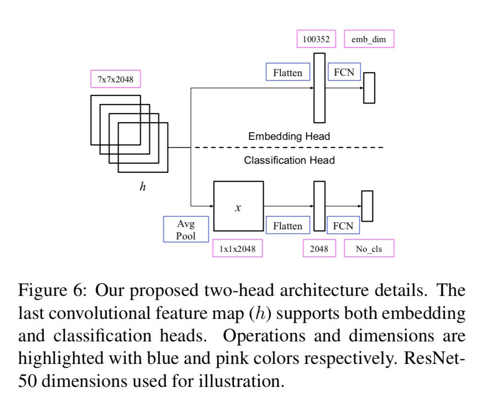
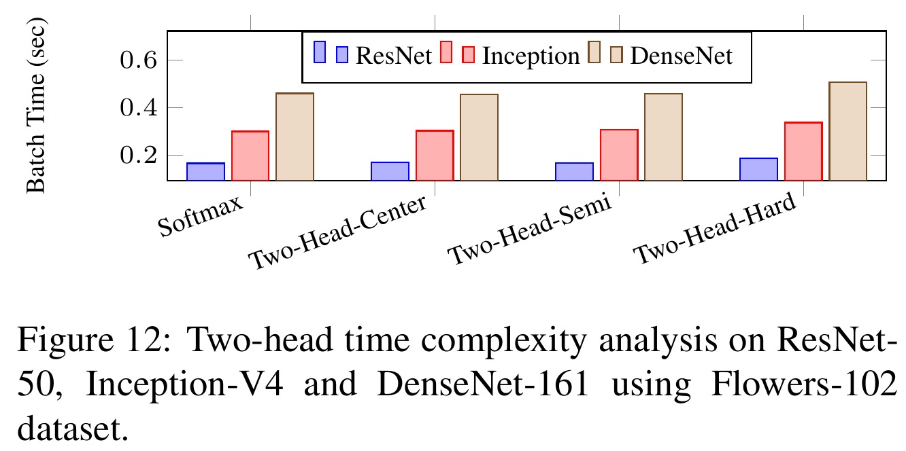

# Softmax + a Ranking Regularizer

This repository contains the tensorflow implementation of [**Boosting Standard Classification Architectures Through a Ranking Regularizer** ](https://arxiv.org/abs/1901.08616)
> (formely known as **In Defense of the Triplet Loss for Visual Recognition**)

This code employs triplet loss as a feature embedding regularizer to boost classification performance. It extends standard architectures, like ResNet and Inception, to support both losses with minimal hyper-parameter tuning. 
During inference, our network supports both classification and embedding tasks without any computational overhead. Quantitative evaluation highlights a steady improvement on five fine-grained recognition datasets. Further evaluation on an imbalanced video dataset achieves significant improvement.

## Requirements

* Python 3+ [Tested on 3.4.7]
* Tensorflow 1+ [Tested on 1.8]

## Usage example

Update [`base_config._load_user_setup`](https://github.com/ahmdtaha/softmax_triplet_loss/blob/f8cfa2e08484dfdd2e2c15d47ed634c037c87d90/config/base_config.py#L98) with your machine configurations

- Where is the datasets dir?
- Where is the pre-trained model dir? I use [TF slim pretrained models](https://github.com/tensorflow/models/tree/master/research/slim)
- Where to save tf checkpoints?

The current `main.py` is configured to use [FGVC-Aircraft dataset](http://www.robots.ox.ac.uk/~vgg/data/fgvc-aircraft/). To run the code smoothly, your `datasets` dir should contain a directory named `aircrafts` with the following structure
<pre>
.
├── fgvc-aircraft-2013b
│   └── data
│       └── images
└── lists
</pre>

This is the default directory structure when you download the [FGVC-Aircraft dataset](http://www.robots.ox.ac.uk/~vgg/data/fgvc-aircraft/) except for the `lists` dir. The `lists` dir contains csv files that defines the train, validation and testing splits. For the aircraft dataset, the splits are [defined here](https://github.com/ahmdtaha/softmax_triplet_loss/tree/master/datasets_lists/aircrafts/lists). Similar splits format for other datasets is available [in this repos](https://github.com/ahmdtaha/FineGrainedVisualRecognition/tree/master/dataset_sample)

Most of the datasets, pretrained, and checkpoint settings are handled in the base_config.py module. Once you have these configuration and parameters set, you should be able to train the network using `python main.py`

This code achieves the following classification performance on **ResNet-50**

|                            | Cars  | Flowers | Dogs  | Aircrafts | Birds |
|----------------------------|-------|---------|-------|-----------|-------|
| Softmax                    | 85.85 | 85.68   | 69.76 | 83.22     | 64.23 |
| Two-head-Center            | 88.23 | 85.00   | 70.45 | 84.48     | 65.50 |
| Two-Head-Semi-Hard Triplet | 88.22 | 85.52   | 70.69 | 85.08     | 65.20 |
| Two-Head-Hard Triplet      | 89.44 | 86.61   | 72.70 | 87.33     | 66.19 |

## Computational Analysis
The proposed Two-head architecture is computational very cheap. It's training time increases, over the single head softmax, by approximately 2%. The following images shows a quantitative timing analysis comparing the single head vs two-head architecture using multiple standard architectures

## Release History

* 0.0.1
    * CHANGE: Add quantitative results and timing analysis 7 Jan 2020
    * CHANGE: First commit 27 Aug 2019
    * CHANGE: Clean code & Update Readme file 07 Sep 2019

### TODO LIST
* Add code comments
* Improve code documentation
* Report quantitative evaluation

## Contributing

**Both tips to improve the code and pull requests to contribute are very welcomed**

### What needs to be done
1 - Support Tensorflow 1.4 & 2